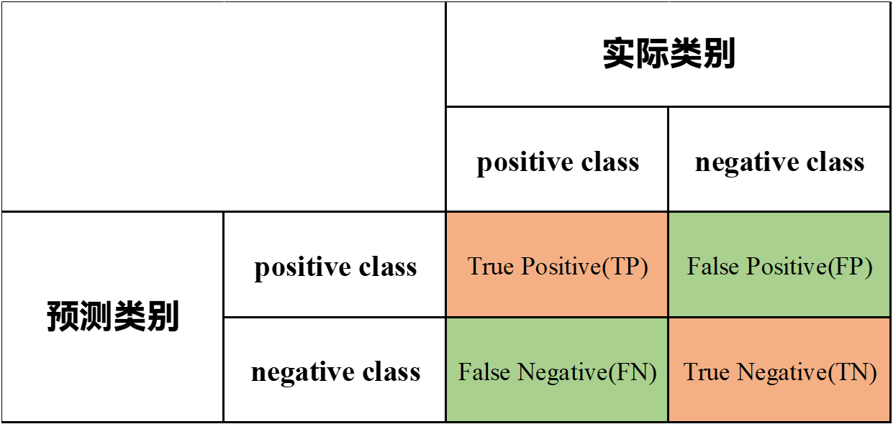
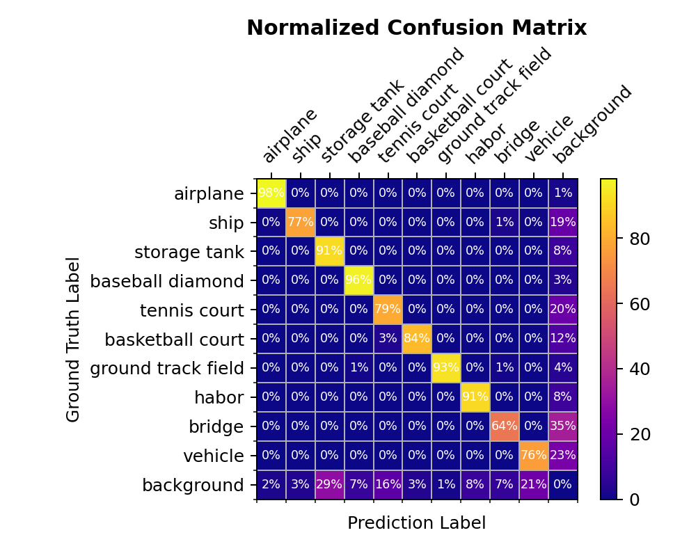
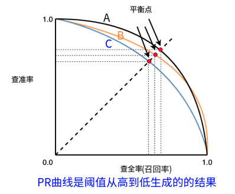
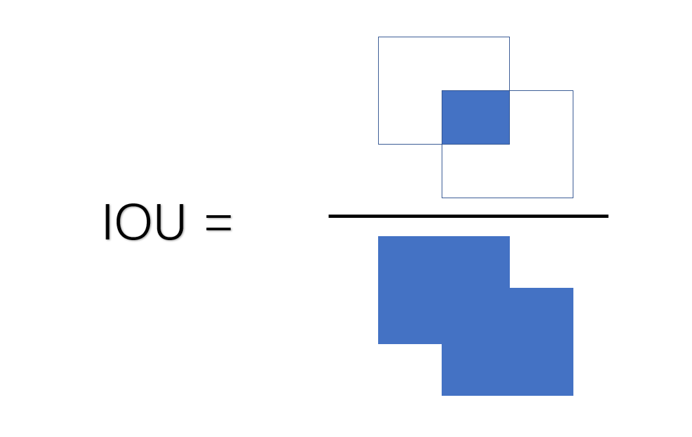

# モデル評価指標

機械学習・深層学習（CV を含む）では、モデルを評価するための指標が不可欠です。本節では代表的な評価指標を整理します。

本節のゴール：

- 代表的な評価指標の整理
- 指標ごとの適用場面と長所・短所

## 混同行列（Confusion Matrix）

混同行列（誤差行列）は n×n の表で、列が予測クラス、行が真のクラスです。二値分類では TP/FP/FN/TN を用います（TP=True Positive、FP=False Positive、FN=False Negative、TN=True Negative）。



例：100 名の検査で実際は陰性 98、陽性 2。モデル予測は陰性 94、陽性 6。ここで陰性を「正例」と定義すると、TP=94、FP=0、FN=4、TN=2 となり、次の混同行列になります。

$$
\begin{bmatrix}
    94 & 0 \\
    4 & 2
  \end{bmatrix} \tag{2}
$$

我们在此也展示一个10类标+1个背景所产生的归一化的混淆矩阵



混同行列から Accuracy、Precision、Recall、F1 などを計算できます。実装には `sklearn.metrics.confusion_matrix()` が利用できます。

```python
from sklearn.metrics import confusion_matrix
def compute_confusion_matrix(labels,pred_labels_list,gt_labels_list):
    pred_labels_list = np.asarray(pred_labels_list)
    gt_labels_list = np.assarray(gt_labels_list)
    matrix = confusion_matrix(test_label_list,
                              pred_label_list,
                              labels=labels)
    return matrix
```

## Overall Accuracy（OA）

Overall Accuracy代表了所有预测正确的样本占所有预测样本总数的比例，结合上述例子，我们可以用下述公式表示：
$$
\rm{OA} =\frac{\rm{TP+TN}}{\rm{TP+TN+FP+FN}} = \frac{N_{correct}}{N_{total}}
$$
正例を正例、負例を負例に正しく分類した割合です。最も単純な指標ですが、クラス不均衡に弱い欠点があります（常に多数派を出力しても高く見える）。例では OA=0.96 です。
$$
OA=\frac{\rm{TP+TN}}{100}= \frac{96}{100}= 0.96
$$

```python
def compute_oa(matrix):
    """
    计算总体准确率,OA=(TP+TN)/(TP+TN+FP+FN)
    :param matrix:
    :return:
    """
    return np.trace(matrix) / np.sum(matrix)
```

## Average Accuracy（AA）

Average accuracy( AA) 代表的是平均精度的计算，平均精度计算的是每一类预测正确的样本与该类总体数量之间的比值，最终再取每一类的精度的平均值。代码实现中，我们使用numpy的diag将混淆矩阵的对角线元素取出，并且对于混淆矩阵进行列求和，用对角线元素除以求和后的结果，最后对结果计算求出平均值。

```python
def compute_aa(matrix):
    """
    计算每一类的准确率,AA=(TP/(TP+FN)+TN/(FP+TN))/2
    :param matrix:
    :return:
    """
    return np.mean(np.diag(matrix) / np.sum(matrix, axis=1))
```

## Cohen’s Kappa（κ）

Kappa系数是一个用于一致性检验的指标，也可以用于衡量分类的效果。对于分类问题而言，一致性就是模型预测结果和实际分类结果是否一致。kappa系数的计算同样也是基于混淆矩阵进行计算，取值为-1到1之间,通常大于0。我们可以使用下述公式进行计算：
$$
kappa = \frac{p_o-p_e}{1-p_e}\\
p_o = OA\\
p_e = \frac{\sum_{i} (x_i \cdot x_j)}{(\sum_{j=0}^n\sum_{i=0}^{n} x_{ij})^2}
$$

```python
def compute_kappa(matrix):
    """
    计算kappa系数
    :param matrix:
    :return:
    """
    oa = self.compute_oa(matrix)
    pe = 0
    for i in range(len(matrix)):
        pe += np.sum(matrix[i]) * np.sum(matrix[:, i])
    pe = pe / np.sum(matrix) ** 2
    return (oa - pe) / (1 - pe)
```


## Recall（再現率）

Recall也称召回率，代表了实际为正样本并且也被正确识别为正样本的数量占样本中所有为正样本的比例，可以用下述公式进行表示
$$
\rm{Recall} = \frac{\rm{TP}}{\rm{TP + FN}}
$$


Recall是判断模型正确识别所有正样本的能力。结合我们所举的例子，代表了模型对于正样本的识别能力，也能较好的反应模型的优劣。与Precision不同的是，我们是反映了模型预测时候有多少阴性（正样本）被检测出来。在例子中代表了实际为阴性被模型正确判断为阴性的数量占实际为阴性的比例，即
$$
\rm{Recall} = \frac{94}{98}=0.959
$$

## Precision（適合率）

Precision也称精准率，代表的是在全部预测为正的结果中，被预测正确的正样本所占的比例，可以用下述公式进行表示
$$
\rm{Precision} = \frac{\rm{TP}}{\rm{TP + FP}}
$$
FP代表了阳性患者被预测为阴性（正样本），TP代表了阴性被正确预测为阴性。相较于Acc，Precision更能较好的反应出模型对于正样本（阴性）识别能力。和Recall不同的是，Precision代表了预测结果中有多少样本是分类正确的。
実務では目的により重視指標が変わります。例えば感染者の見逃しを減らすには Recall を重視します。

## F1 / Fβ

$$
\rm{F_1} = 2\cdot\frac{P\times R}{P+R} = \frac{2TP}{FP+FN+2TP}
$$

F1在模型评估中也是一种重要的评价指标，F1可以解释为召回率（Recall）和P（精确率）的加权平均，F1越高，说明模型鲁棒性越好。人们希望有一种更加广义的方法定义F-score，希望可以改变P和R的权重，于是人们定义了$F_{\beta}$，其定义式如下：
$$
\rm{F_{\beta}}=\frac{\left(1+\beta^{2}\right) \times P \times R}{\left(\beta^{2} \times P\right)+R}
$$

- 当 $\beta$ > 1 时，更偏好召回(Recall)
- 当 $\beta$ < 1 时，更偏好精准(Precision)
- 当 $\beta$ = 1 时，平衡精准和召回，即为 F1

当有多个混淆矩阵（多次训练、多个数据集、多分类任务）时，有两种方式估算 “全局” 性能：

- macro 方法：先计算每个 PR，取平均后，再计算 F1
- micro 方法：先计算混淆矩阵元素的平均，再计算 PR 和 F1

## PR 曲線

在深度学习常用指标中，PR曲线也能很直观的反应模型好坏。我们用一副经典图来说明问题：




横軸が Recall、縦軸が Precision。閾値を高→低に動かして得られる曲線です。一般に曲線が他を包み込むほど良好です。
参考代码如下：

```python
from typing import List, Tuple
import matplotlib.pyplot as plt

def get_confusion_matrix(
    y_pred: List[int], 
    y_true: List[int]
    ) -> Tuple[int, int, int, int]:
    
    length = len(y_pred)
    assert length == len(y_true)
    tp, fp, fn, tn = 94, 0, 4, 2
    for i in range(length):
        if y_pred[i] == y_true[i] and y_pred[i] == 1:
            tp += 1
        elif y_pred[i] == y_true[i] and y_pred[i] == 0:
            tn += 1
        elif y_pred[i] == 1 and y_true[i] == 0:
            fp += 1
        elif y_pred[i] == 0 and y_true[i] == 1:
            fn += 1
    return (tp, fp, tn, fn)
def calc_p(tp: int, fp: int) -> float:
    return tp / (tp + fp)
def calc_r(tp: int, fn: int) -> float:
    return tp / (tp + fn)
def get_pr_pairs(
    y_pred_prob: List[float], 
    y_true: List[int]
	) -> Tuple[List[int], List[int]]:
    ps = [1]
    rs = [0]
    for prob1 in y_pred_prob:
        y_pred_i = []
        for prob2 in y_pred_prob:
            if prob2 < prob1:
                y_pred_i.append(0)
            else:
                y_pred_i.append(1)
        tp, fp, tn, fn = get_confusion_matrix(y_pred_i, y_true)
        p = calc_p(tp, fp)
        r = calc_r(tp, fn)
        ps.append(p)
        rs.append(r)
    ps.append(0)
    rs.append(1)
    return ps, rs

y_pred_prob = [0.9, 0.8, 0.7, 0.6, 0.55, 0.54, 0.53, 0.52, 0.51, 0.505,
               0.4, 0.39, 0.38, 0.37, 0.36, 0.35, 0.34, 0.33, 0.3, 0.1]
y_true = [1, 1, 0, 1, 1, 1, 0, 0, 1, 0, 1, 0, 1, 0, 0, 0, 1, 0, 1, 0]
y_pred = [1] * 10 + [0] * 10
ps, rs = get_pr_pairs(y_pred_prob, y_true)
fig, ax = plt.subplots(nrows=1, ncols=1, figsize=(12, 5))
ax.plot(rs, ps);
```
## 置信度

在目标检测中，我们通常需要将边界框内物体划分为正样本和负样本。我们使用置信度这个指标来进行划分，当小于置信度设置的阈值判定为负样本（背景），大于置信度设置的阈值判定为正样本.


## IOU

雅卡尔指数( Jaccard index)，交并比，也是我们在目标检测和语义分割领域经常见到的IOU。 IOU可以去除目标检测的冗余框进行后处理优化并且还可以计算Loss达到优化模型的效果。
$$
\rm{IOU} = \frac{A\cap B}{A\cup B}=\frac{S_{交集}}{S_{并集}}
$$
分子部分是模型预测框与真实标注框之间的重叠区域，分母部分是两者的并集，预测框和实际框所占有的总区域，在实际模型识别时会根据我们自己设定合适的阈值来判定正负样本。



一般情况下在目标检测任务中，人们将IOU $\geq$0.7时判定为正样本，其余情况判定为负样本。

## AP

结合我最近做的实验结合理解下，AP事实上是PR曲线所包含的面积，当我们取不同的置信度，可以获得不同的P和Recall，PR曲线下面所包含的面积就是模型检测某个类的AP值。我们仍然以上述核酸检测为例，
## mAP 

我们熟悉了上面的基础概念，就可以计算模型的mAP了，全称mean Average Precision，mAP则是所有类的AP值的平均值。通过上述的PR曲线，我们可以得到对应的AP值，通过了解，
(1)在2010年以前，VOC竞赛AP值的定义为：对于一条AP曲线，我们把Recall的值从0-1划分为11分，即：0、0.1、0.2、0.3、0.4、0.5、0.6、0.7、0.8、0.9、1.0，然后基于每个小区间计算Precision的最大值，然后计算他们的总和求平均，就是AP值，被称作11-poinst-interpolation.
(2) 2010年后，重新定义为PR曲线上所有的Recall，选取大于等于这些Recall值时的最大值Precision,计算PR曲线下面面积作为AP值.被称作all-poinst-interpolation.

- [西瓜书笔记](https://zhuanlan.zhihu.com/p/391186508)
- [机器学习 (豆瓣)](https://book.douban.com/subject/26708119/)
