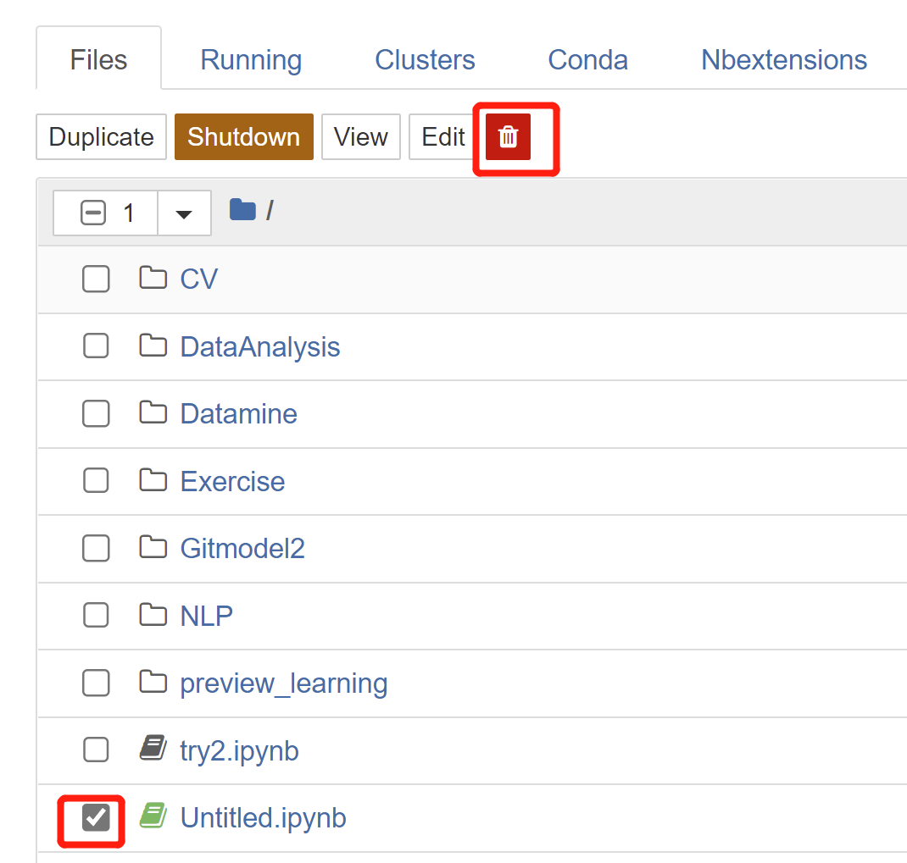
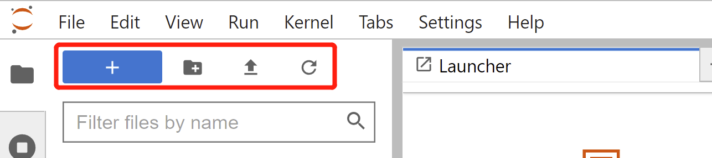

# Jupyter Notebook/Lab 概要
データサイエンスや機械学習では、可視化と対話的な計算が重要です。Jupyter Notebook はブラウザ上でコード実行と結果表示ができ、開発・ドキュメント・実行・結果提示まで一貫して扱えます。Notebook は `.ipynb`（JSON）として保存され、HTML/LaTeX/Markdown/PDF にエクスポートできます。主な特徴：

* 構文ハイライト・インデント・タブ補完

* ブラウザでコード実行、セル下に結果表示

* HTML/LaTeX/PNG/SVG などのリッチメディア表示

* Markdown で説明を併記可能

* LaTeX で数式を記述可能

加えて、Jupyter Notebook には「双子」とも言える JupyterLab があります。JupyterLab は Web ベースの統合開発環境で、Notebook の進化版と考えられます。1 つのブラウザタブで複数の Notebook、IPython コンソール、ターミナルを同時に扱え、Google Drive などのサービス連携も可能です。モジュール式の UI で IDE に近い体験を提供し、Notebook から JupyterLab へ移行するユーザーが増えています。


[* ]この章の学習目標：

* Jupyter Notebook / JupyterLab のインストールと設定
* Jupyter Notebook の基本操作とショートカット
* Notebook 上でのコード記述のコツ
* Notebook の Bash コマンド・マジックコマンドの理解
* Notebook 拡張プラグインの導入方法

## 1 Jupyter Notebook/Lab のインストール

 1. Jupyter Notebook のインストール：仮想環境を有効化し、以下を実行

    ```python
    conda install jupyter notebook
    # pip install jupyter notebook
    ```

* 注: pip のバージョンが古い場合は先に更新します

  ```python
  pip install --upgrade pip
  ```

2. JupyterLab のインストール：同様に以下を実行

   ```python
   conda install -c conda-forge jupyterlab
   # pip install jupyterlab
   ```

3. Notebook/Lab の起動

   ```python
   jupyter notebook  # Jupyter Notebook を開く
   jupyter lab       # JupyterLab を開く
   ```

* ブラウザが自動で開かない場合は、表示された URL/ポートをコピーしてブラウザに貼り付けます

  


* ポートを指定したい場合：

  ```python
  jupyter notebook --port <port_number>
  ```

* サーバのみ起動しブラウザを開かない場合：

  ```python
  jupyter notebook --no-browser
  ```

  

## 2 Jupyter Notebook/Lab の設定

### 2.1 既定の保存先を変更する	

Jupyter Notebook/JupyterLab の既定の作業ディレクトリ（保存先）を変更する手順です。

* Jupyter Notebook の場合

1. 設定ファイルを作成（または場所を表示）します：

   ```python
   jupyter notebook --generate-config
   ```

2. 出力された設定ファイルのパスを控え、エクスプローラ等で開きます（端末の質問は N で可）


4. フォルダ内の設定ファイルを開きます


5. `Ctrl+F` で `# c.NotebookApp.notebook_dir = ''` を検索

6. コメントアウトを外し、希望のパスに変更：`c.NotebookApp.notebook_dir = 'D:\\Adatascience'`


7. 以後 `jupyter notebook` を起動すると既定の作業ディレクトリが変更されます。なお、スタートメニュー等のショートカットから起動した場合は未反映のことがあります。


8. ショートカットの作業フォルダを変更するには、ショートカットのプロパティから対象を編集します：


9. 「リンク先」の赤枠部分を削除（または適切に編集）して保存します


10. 以後はショートカットから起動しても、設定した作業ディレクトリが使われます。


* JupyterLab の場合（Notebook と概ね同様ですが、キーが少し異なります）

1. まず設定ファイルを生成：

   ```python
   jupyter lab --generate-config
   ```

2. 設定ファイルの場所を開きます

3. `# c.ServerApp.notebook_dir` のコメントを外し、`c.ServerApp.notebook_dir = 'D:\\Adatascience（任意のパス）'` に変更

4. 以降は Notebook の手順 7〜10 と同様です

### 2.2 仮想環境を Notebook で使う

Anaconda の仮想環境は、そのままでは Notebook のカーネルとして認識されません。以下の手順で追加し、必要に応じて Kernel を切り替えます。

1. 対象の仮想環境に `ipykernel` を導入する

```python
# まだ環境を作成していない場合：作成時に ipykernel を含める
conda create -n env_name python=3.8 ipykernel
# 既存環境の場合：環境内で ipykernel をインストール
pip install ipykernel
```

2. 仮想環境を Jupyter に登録する

```python
python -m ipykernel install --user --name env_name --display-name "env_name"
```

3. Notebook のメニューから `Kernel` → 追加した環境を選択


## 3 Jupyter Notebook/Lab の基本操作

### 3.1 基本使用

#### 3.1.1 Jupyter Notebook

1. 新規作成：右上の New から Notebook／Folder を選択


2. 削除：対象のチェックボックスを選び、削除アイコンをクリック



3. リネーム：実行中（緑の丸アイコン）の場合は「Shutdown」で停止後に「Rename」


4. フォルダ名の変更：「Rename」を使用
5. 複製（Duplicate）／移動（Move）／ダウンロード（Download）／表示（View）なども上部アイコンから操作

#### 3.1.2 JupyterLab

1. 画面上部のボタン（左から）：新規ファイル／新規フォルダ／アップロード／再読込



2. 複数ファイルのアップロード：

* ファイルを zip にまとめる
* その zip をアップロード
* Notebook 内で解凍：`!unzip <zip のパス> -d <展開先>` 例：`!unzip coco.zip -d data/coco`
* zip を削除


### 3.2 よく使うショートカット

1. 入門操作

   ```python
   # 追加/下に追加/切り取り/保存/削除 など
   # a, b, x, s, dd
   
   # セル結合／実行して次へ／実行して留まる
   # Shift+M / Shift+Enter / Ctrl+Enter
   
   # 行番号の表示／markdown と code の切替
   # l, m/y
   ```

2. Notebook では Enter で編集モード、Esc でコマンドモードに切替

* **編集モード（緑）**

  

* **コマンドモード（青）**

  

* コマンドモードで h を押すとショートカット一覧が開きます


3. Jupyter Lab同样有两种模式。按下Enter进入编辑模式，按下Esc进入命令模式

* 编辑模式（有框线无光标）


* 命令模式（无框线无光标）


* 快捷键操作与Jupyter Notebook基本相同，可参考上一部分

4. 快捷键汇总

​			命令模式（按`Esc`）

- **Enter** : 转入编辑模式
- **Shift-Enter** : 运行本单元，选中下个单元
- **Ctrl-Enter** : 运行本单元
- **Alt-Enter** : 运行本单元，在其下插入新单元
- **Y** : 单元转入代码状态
- **M** :单元转入markdown状态
- **R** : 单元转入raw状态
- **1** : 设定 1 级标题
- **2** : 设定 2 级标题
- **3** : 设定 3 级标题
- **4** : 设定 4 级标题
- **5** : 设定 5 级标题
- **6** : 设定 6 级标题
- **Up** : 选中上方单元
- **K** : 选中上方单元
- **Down** : 选中下方单元
- **J** : 选中下方单元
- **Shift-K** : 扩大选中上方单元
- **Shift-J** : 扩大选中下方单元
- **A** : 在上方插入新单元
- **B** : 在下方插入新单元
- **X** : 剪切选中的单元
- **C** : 复制选中的单元
- **Shift-V** : 粘贴到上方单元
- **V** : 粘贴到下方单元
- **Z** : 恢复删除的最后一个单元
- **D,D** : 删除选中的单元
- **Shift-M** : 合并选中的单元
- **Ctrl-S** : 文件存盘
- **S** : 文件存盘
- **L** : 转换行号
- **O** : 转换输出
- **Shift-O** : 转换输出滚动
- **Esc** : 关闭页面
- **Q** : 关闭页面
- **H** : 显示快捷键帮助
- **I,I** : 中断Notebook内核
- **0,0** : 重启Notebook内核
- **Shift** : 忽略
- **Shift-Space** : 向上滚动
- **Space** : 向下滚动

​		编辑模式（按`Enter`）

- **Tab** : 代码补全或缩进
- **Shift-Tab** : 提示
- **Ctrl-]** : 缩进
- **Ctrl-[** : 解除缩进
- **Ctrl-A** : 全选
- **Ctrl-Z** : 复原
- **Ctrl-Shift-Z** : 再做
- **Ctrl-Y** : 再做
- **Ctrl-Home** : 跳到单元开头
- **Ctrl-Up** : 跳到单元开头
- **Ctrl-End** : 跳到单元末尾
- **Ctrl-Down** : 跳到单元末尾
- **Ctrl-Left** : 跳到左边一个字首
- **Ctrl-Right** : 跳到右边一个字首
- **Ctrl-Backspace** : 删除前面一个字
- **Ctrl-Delete** : 删除后面一个字
- **Esc** : 进入命令模式
- **Ctrl-M** : 进入命令模式
- **Shift-Enter** : 运行本单元，选中下一单元
- **Ctrl-Enter** : 运行本单元
- **Alt-Enter** : 运行本单元，在下面插入一单元
- **Ctrl-Shift--** : 分割单元
- **Ctrl-Shift-Subtract** : 分割单元
- **Ctrl-S** : 文件存盘
- **Shift** : 忽略
- **Up** : 光标上移或转入上一单元
- **Down** :光标下移或转入下一单元

### 3.3 安装插件

* Jupyter Notebook安装插件的方法

1. 在Anaconda Powershell Prompt中输入

   ```python
   pip install jupyter_contrib_nbextensions
   ```

2. 再次输入以下指令，将插件添加到工具栏

   ```python
   jupyter contrib nbextension install
   ```

3. 打开Jupyter Notebook，点击Nbextensions，取消勾选`disable configuration for nbextensions without explicit compatibility`，此时可以添加自己喜欢的插件啦！


4. 推荐以下两个基础插件

*  Execute Time：可以显示执行一个Cell要花费多少时间
*  Hinterland：提供代码补全功能


* Jupyter Lab安装插件的方法

1. Jupyter Lab安装插件点击左侧的第四个标志，点击“Enable”后就可以在搜索栏中搜索想要的插件


2. 例如搜索`jupyterlab-execute-time`后，在Search Results中查看结果，点击Install便可安装插件


3. 还可以在Anaconda Powershell Prompt中使用指令来安装插件

   ```python
   jupyter labextension install jupyterlab-execute-time  # 安装jupyterlab-execute-time
   ```

   

## 4 进阶操作

​		除了以上操作，Jupyter Notebook还有许多丰富的内容等待大家探索。如Bash命令、魔术命令等。我们为大家提供了一份在Notebook中编写的进阶操作，快来试试看吧~

​		[点击查看进阶教程](https://github.com/datawhalechina/thorough-pytorch/blob/main/notebook/%E7%AC%AC%E9%9B%B6%E7%AB%A0%20%E5%89%8D%E7%BD%AE%E7%9F%A5%E8%AF%86%E8%A1%A5%E5%85%85/%E8%BF%9B%E9%98%B6%E6%93%8D%E4%BD%9C.ipynb)


## 5 参考资料

【1】[Jupyter Notebook介绍、安装及使用教程 - 知乎 (zhihu.com)](https://zhuanlan.zhihu.com/p/33105153)

