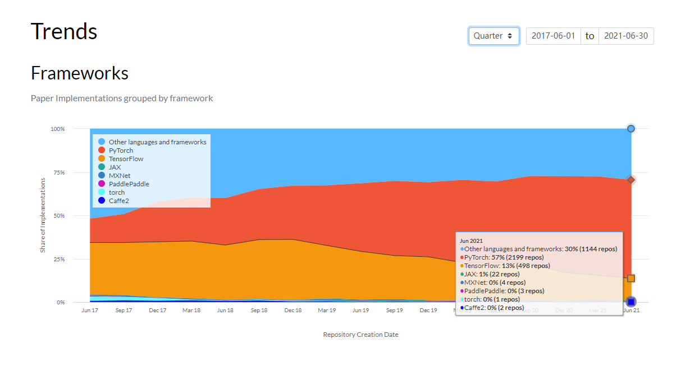

# 1.1 PyTorch 概要

PyTorch は Meta AI（旧 Facebook AI Research）が Torch（Lua ベース）の思想を受け継いで Python で実装した深層学習ライブラリです。学術・産業の両分野で広く使われており、TensorFlow 2.x と比べても API が簡潔・直感的で学びやすいのが特徴です。本コースでは PyTorch を用いて学習を進めます。

本節のゴール：

- PyTorch の発展の流れを理解する
- 他フレームワークと比べた PyTorch の強みを把握する

## 1.1.1 PyTorch の発展

“All in PyTorch”——登場以来、PyTorch は多くの支持を集めてきました。下図は [Papers with Code](https://paperswithcode.com/trends) のデータで、色の面積は「そのフレームワークで公開された実装の数」を示します。2021年6月時点で、PyTorch 実装は TensorFlow の約4倍に達し、学術界では PyTorch が主流になりつつあります。さらに ONNX との連携により、産業界での展開力も着実に高まっています。

もちろん、PyTorch 1.x にも課題はありますが、2.x 系での進化により一層の利便性が期待できます。

## 1.1.2 PyTorch の強み
- より簡潔: 最小限の抽象化で分かりやすい設計。車輪の再発明を避ける思想。
- 習得が速い: NumPy と基本的な深層学習の知識でスムーズに開始できる。
- 充実したドキュメントとコミュニティ: 公式フォーラムで開発者と直接議論可能。Meta AI の強力なバックアップにより継続的な更新が期待できる。
- オープンソースの活発さ: GitHub 上の多数の最新実装が PyTorch ベース。
- デバッグがしやすい: 逐次実行・標準的な Python デバッグ手法が活用しやすく、失敗箇所を特定しやすい。
- エコシステムの拡大: 周辺ライブラリが成熟し、今が“旬”。

