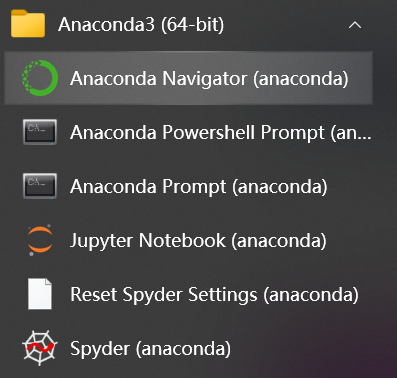
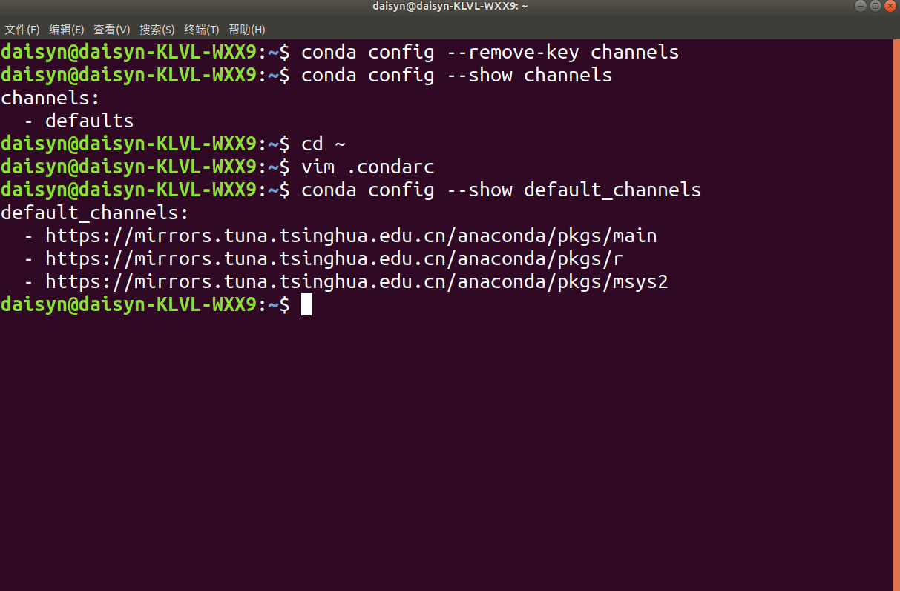
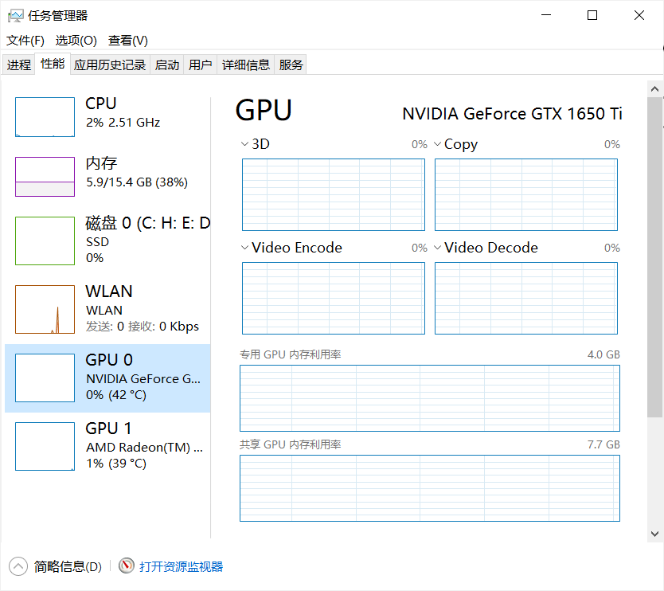
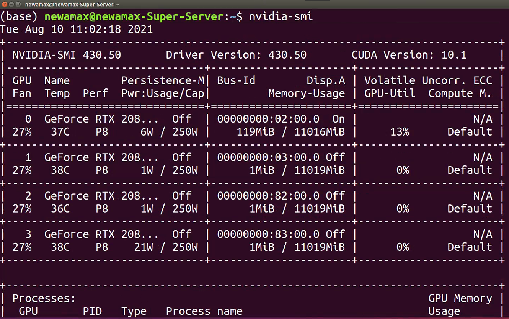
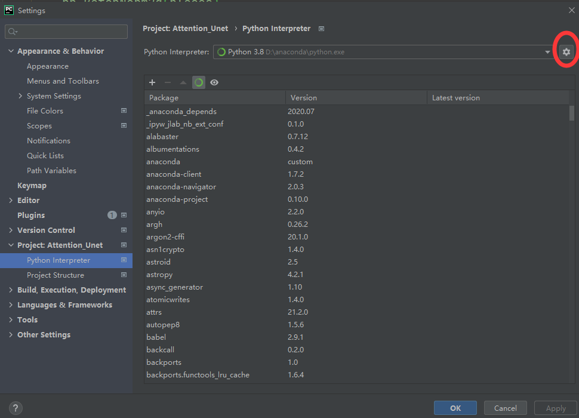
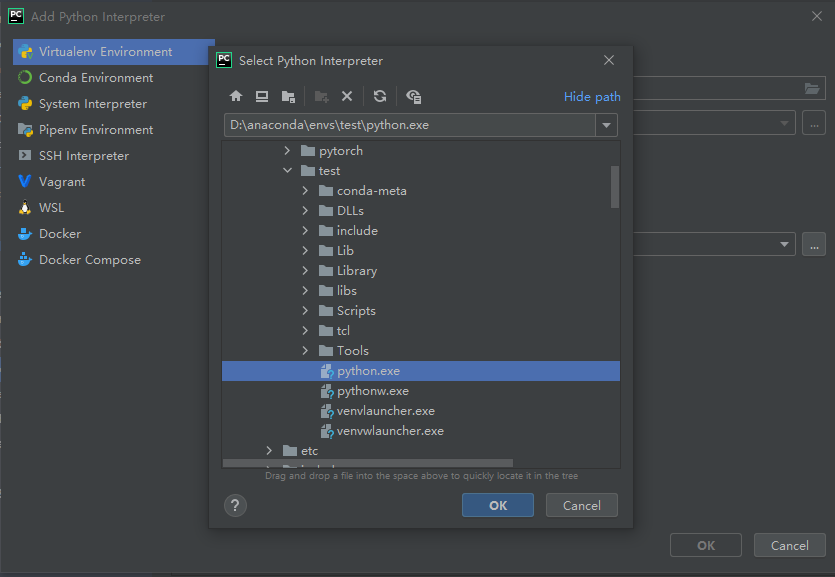

# 1.2 PyTorch のインストール

PyTorch の導入は学習の第一歩であり、つまずきやすい箇所でもあります。ここでは一般的な「Anaconda/miniconda + PyTorch + IDE」という流れで解説します。

本節のゴール：

- Anaconda/miniconda の導入と基本コマンド
- PyTorch のインストール手順
- 自分の環境に合う PyTorch バージョンの選び方

## 1.2.1 Anaconda のインストール

データサイエンスや深層学習では多くのパッケージを使います。個別インストールは依存関係の不整合が起きがちです。Anaconda/miniconda は科学計算向けパッケージをまとめて提供し、`conda` による仮想環境管理で依存関係も整理できます。

### Step 1：Anaconda/miniconda を入手
[Anaconda | Individual Edition](https://www.anaconda.com/products/individual) から OS に合うインストーラを取得します（Linux で miniconda を使う場合は [こちら](https://docs.conda.io/en/latest/miniconda.html) も参照）。


### Step 2：インストール確認
Windows は「Anaconda Prompt」を起動、Linux/macOS はターミナルで確認します。



### Step 3：仮想環境を作成
Windows は `Anaconda Prompt`、Linux/macOS はターミナルで実行します。

#### 既存の環境一覧
作成済みの仮想環境を確認します。

```bash
conda env list 
```


#### 新しい環境の作成
用途に応じて Python バージョンごとに環境を分けるのが一般的です。
```bash
conda create -n env_name python==version 
# 注: env_name を環境名に、version を該当バージョンに置き換える（例: 3.8）
```


注意：
1) ここでの warning は検証環境によるものです。通常は表示されません。
2) Python バージョンは依存関係の都合で高すぎないものを推奨（例：3.8〜3.10 など、各自の要件に応じて）。

#### パッケージのインストール
```bash
conda install package_name 
# 注: package_name をインストールしたいパッケージ名に置き換える（例: pandas）
```
#### パッケージのアンインストール
```bash
conda remove package_name
# 注: package_name をアンインストールしたいパッケージ名に置き換える（例: pandas）
```
#### インストール済み一覧
```bash
conda list
```
#### 仮想環境の削除

```bash
conda remove -n env_name --all 
# 注: env_name を該当の環境名に置き換える
```

#### 仮想環境の有効化

```bash
conda activate env_name
# 注: env_name を該当の環境名に置き換える
```
#### 仮想環境の無効化
```bash
conda deactivate
```
その他のコマンドは公式ドキュメントを参照してください：[Conda Commands](https://docs.conda.io/projects/conda/en/latest/commands.html#conda-general-commands)
### Step 4：ミラー設定（任意）

`pip install` や `conda install` のダウンロードが遅い場合はミラーを設定します。単発なら `pip install package_name -i https://pypi.tuna.tsinghua.edu.cn/simple` のようにインデックス URL を一時指定する方法もあります。

#### pip のミラー設定

##### Linux：
ホームディレクトリに `.pip/pip.conf` を作成します。
```bash
cd ~
mkdir .pip/
vi pip.conf
```
`pip.conf` に以下を記述します（例：Douban ミラー）。
```bash
[global]
index-url = http://pypi.douban.com/simple
[install]
use-mirrors =true
mirrors =http://pypi.douban.com/simple/
trusted-host =pypi.douban.com
```

##### Windows：
`%APPDATA%` 直下に `pip` フォルダを作成し、その中に `pip.ini` を作ります。内容は以下の通り（例：Douban ミラー）。

```bash
[global]
index-url = http://pypi.douban.com/simple
[install]
use-mirrors =true
mirrors =http://pypi.douban.com/simple/
trusted-host =pypi.douban.com
```

#### conda のミラー（清華 TUNA）[公式手順](https://mirrors.tuna.tsinghua.edu.cn/help/anaconda/)

##### Windows：
ユーザーディレクトリの `.condarc` を編集します（無ければ `conda config --set show_channel_urls yes` で生成）。

`C:\Users\User_name\.condarc` を次の内容に置き換えます。

```bash
channels:
  - defaults
show_channel_urls: true
default_channels:
  - https://mirrors.tuna.tsinghua.edu.cn/anaconda/pkgs/main
  - https://mirrors.tuna.tsinghua.edu.cn/anaconda/pkgs/r
  - https://mirrors.tuna.tsinghua.edu.cn/anaconda/pkgs/msys2
custom_channels:
  conda-forge: https://mirrors.tuna.tsinghua.edu.cn/anaconda/cloud
  msys2: https://mirrors.tuna.tsinghua.edu.cn/anaconda/cloud
  bioconda: https://mirrors.tuna.tsinghua.edu.cn/anaconda/cloud
  menpo: https://mirrors.tuna.tsinghua.edu.cn/anaconda/cloud
  pytorch: https://mirrors.tuna.tsinghua.edu.cn/anaconda/cloud
  simpleitk: https://mirrors.tuna.tsinghua.edu.cn/anaconda/cloud
```

適用後、`Anaconda Prompt` で `conda clean -i` を実行し、インデックスキャッシュを削除します。

##### Linux：
Linux でもホーム直下の `.condarc` を作成・編集します。
```bash
cd ~
vi .condarc
```
上記内容を保存後、`conda config --show default_channels` で反映を確認できます。問題なければ `conda clean -i` も実行します。


`conda config --show default_channels` を実行して、ミラー設定が反映されたか確認できます。下図のように表示されれば成功です。



あわせて `conda clean -i` でインデックスキャッシュを削除し、ミラーの索引が使われるようにします。

## 1.2.2 GPU の確認（任意）
CPU のみの環境は本節をスキップして構いません。

### Windows：
`nvidia-smi`（Linux も同様）、NVIDIA コントロールパネル、タスクマネージャで GPU とドライバを確認します。




### Linux：



CUDA の対応バージョンを把握します（PyTorch は基本的に下位互換の組合せも用意されています）。


## 1.2.3 PyTorch のインストール

### Step 1： [PyTorch 公式サイト](https://pytorch.org/) を開く


### Step 2：Install セクションへ


ローカル導入（Start Locally）、クラウド（Cloud Partners）、過去バージョン（Previous Versions）、モバイル（Mobile）の選択肢があります。ここではローカル導入を選びます。

### Step 3：コマンド選択と実行
自分の環境（OS・パッケージ管理・CPU/GPU）に合わせて表示されるコマンドをコピーし、`conda` もしくは `pip` で実行します（推奨：`conda`）。

`Terminal` で `conda activate env_name` を実行し、対象の環境でインストールを行います。


注意事項：
1) Stable は安定版、Preview は先行版です。
2) GPU を使う場合は CUDA 版を選びます（NVIDIA 製 GPU が必要）。CPU しか無い場合は CPU 版を選びます。
3) 公式は Anaconda/miniconda での管理を推奨しています。
4) システム要件（抜粋）：
   - Windows: 7 以降（推奨: 10 以降）/ Windows Server 2008 R2 以降
   - Linux: 例）CentOS 7.3-1611 以降、Ubuntu 13.04 以降（CUDA の最大対応は版により異なる）
   - macOS: 10.10 以降
5) 古い GPU で対応 CUDA が 10.2 未満などの場合、`cudatoolkit` のバージョンを手動指定して整合を取ります（PyTorch と `cudatoolkit` の対応表は [Previous Versions](https://pytorch.org/get-started/previous-versions/) を参照）。

### Step 4：オンラインでの取得

`Anaconda Prompt`/ターミナルからダウンロードする場合は、先に `conda activate env_name` で対象の仮想環境を有効化してからコマンドを実行します。

注: 清華 TUNA ミラーを使う場合は、コマンド末尾の `-c pytorch` を外してください（付けたままだと公式のチャネルが優先されます）。

### Step 5：オフラインでの取得

#### Windows：

環境によってはネットワークの事情などでオンラインインストールが失敗することがあります。その場合は、あらかじめパッケージをダウンロードしておき、オフラインでインストールできます。

ダウンロード先（例）：https://mirrors.tuna.tsinghua.edu.cn/anaconda/cloud/pytorch/

上記のダウンロードページから使用環境に合う `pytorch` と `torchvision` のパッケージを取得し、`Anaconda Prompt`/`Terminal` で保存先のディレクトリへ移動します。

```bash
cd package_location
conda activate env_name
```
続いて、次のコマンドで 2 つのパッケージをインストールします。

```bash
conda install --offline <pytorch パッケージの完全なファイル名（拡張子含む）>
conda install --offline <torchvision パッケージの完全なファイル名（拡張子含む）>
```

#### Step 6：インストール確認

対象の**仮想環境**で `python` を起動し、次のコードを入力します。

```python
import torch

torch.cuda.is_available()
```
```bash
False
```
この結果は「CUDA が利用可能か」を確認しています。**CPU 版をインストールした場合は False、GPU が利用可能なら True** が返ります。エラーが出ずにこのチェックが実行できれば、概ねインストールは成功です。

- Windows の例


- Linux の例


PyTorch のインストールはバージョンや環境差で手こずることがあります。うまくいかない場合でも、原因を切り分けつつ手順を見直せば必ず解決できます。焦らずに進めましょう。

##  1.2.4 PyCharm の設定（任意）

VS Code など他の IDE でも問題ありません。PyCharm は必須ではありません。

Linux／Windows ともに手順は同様です。Windows ユーザーには PyCharm を推奨します（Linux では主流 IDE が異なるため）。

### Step 1：公式サイトから入手
[公式サイト](https://www.jetbrains.com/pycharm/) からダウンロードします。学生は学生メールで登録すれば Professional 版を無償利用できます。Community 版でも日常用途には十分です。


### Step 2：仮想環境をインタプリタに設定
仮想環境をプロジェクトの Python インタプリタに設定します。
操作: File → Settings → Project:（プロジェクト名） → Python Interpreter

既定では `base` 環境が選ばれているため、`test` など目的の環境に切り替えます。右側の「歯車」から「Add」を選択します。



「Conda Environment」→「Existing environment」を選び、`Interpreter` に対象環境下の `python.exe` を指定します。



注: PyCharm のターミナルで仮想環境に入る場合は `conda activate <環境名>` を使用します。

