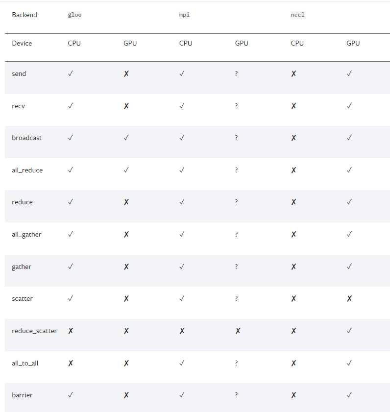

# 2.3 並列計算の基礎

PyTorch で深層学習を行うと、データ量が大きく単一 GPU では足りない、あるいは学習を高速化したい場面が出てきます。そこで並列計算を活用します。本節では少なくとも 1 枚の NVIDIA GPU とドライバが導入済みであることを前提に説明します。

本節のゴール：

- 並列計算の概要
- CUDA の基本
- 代表的な実装パターン 3 つ
- CUDA による学習の高速化

## 2.3.1  なぜ並列化するか

深層学習は計算資源と共に発展してきました。GPU を適切に使うことで学習を速く・大きくできます。PyTorch では複数 GPU を使った並列学習が容易で、学習時間の短縮に有効です。GPU の状態は `nvidia-smi` で確認できます。

## 2.3.2  CUDA が必要な理由

`CUDA` は NVIDIA が提供する GPU 並列計算フレームワークです。低レベルでは CUDA 言語で記述しますが、PyTorch では `.cuda()` や `to('cuda')` などで「このテンソル・モデルは GPU を使う」という指定を意味します。

`.cuda()` を呼ぶと、CPU 上のモデルやテンソルを GPU（既定では 0 番）へ移し、以降の計算を GPU で行います。

注意：
1) GPU 利用は `.cuda()`（`.gpu()` ではない）。CUDA 対応は NVIDIA GPU のみ（AMD は OpenCL。現時点の PyTorch では未対応）。
2) CPU/GPU 間のデータ転送はコストが高いので最小化する。
3) 軽い処理は CPU のほうが速い場合もある。
4) 複数 GPU 環境では使用 GPU を明示する。未指定だと `tensor.cuda()` は 0 番に配置され、`out of memory` の一因になり得る。以下のように指定可能：
   1.  ```python
        # ファイルの冒頭で設定
       import os
       os.environ["CUDA_VISIBLE_DEVICE"] = "2" # 既定で使用する GPU を指定
       ```
   2.  ```bash
        CUDA_VISIBLE_DEVICES=0,1 python train.py  # 0,1 番 GPU を使用
       ```


## 2.3.3  代表的な並列手法

### モデルをデバイス間で分割（Network partitioning）

初期のモデル並列では、モデルの各部を分割して別々の GPU に配置し、それぞれの部分を計算させます。


課題は GPU 間通信の増加です。密結合な層間でのデータ転送はボトルネックになりやすく、次第に主流ではなくなりました。

### 同一層をデバイス間で分割（Layer-wise partitioning）

同一レイヤを分割し、複数 GPU で部分的に計算する方式です。


コンポーネント間の通信は抑えられますが、大規模学習では同期コストが増大し、結局は通信ボトルネックに近い問題が生じます。

### データ並列（Data parallelism）

モデルは複製し、入力データを分割して各 GPU に割り当てます。各 GPU で順伝播・勾配計算を行い、勾配を集約して更新します。


通信の課題を相対的に緩和でき、現在の主流がこのデータ並列です。

## 2.3.4 CUDA で学習を高速化

### 単一 GPU（単カード）
PyTorch では `.cuda()` でモデルやデータを GPU に移すだけで加速できます。

```python
model = Net()
model.cuda() # モデルを CUDA に移す

for image,label in dataloader:
    # 画像とラベルを CUDA に移す
    image = image.cuda() 
    label = label.cuda()
```

### 複数 GPU（マルチカード）

PyTorch には `DataParallel`（DP）と `DistributedDataParallel`（DDP）の 2 方式があります。性能面で公式推奨は DDP ですが、DP は数行で導入でき手軽です。まず DP、続いて DDP を紹介します。

#### 単機・多 GPU（DP）


単機での DP はデータ並列を用います。`nn.DataParallel` を使い、数行の変更で導入できます。

```python
model = Net()
model.cuda() # 模型显示转移到CUDA上

if torch.cuda.device_count() > 1: # 含有多张GPU的卡
	model = nn.DataParallel(model) # 单机多卡DP训练
```

GPU の明示指定は次の 2 通りがあります：

- `nn.DataParallel`函数传入`device_ids`参数，可以指定了使用的GPU编号

  ```python
  model = nn.DataParallel(model, device_ids=[0,1]) # 使用第0和第1张卡进行并行训练
  ```

- 要**手动指定对程序可见的GPU设备**

  ```python
  os.environ["CUDA_VISIBLE_DEVICES"] = "1,2"
  ```

#### 複数機・複数 GPU（DDP）


DP は出力が 0 番 GPU に集約されるなど負荷不均衡が起きやすい欠点があります。`torch.nn.parallel.DistributedDataParallel`（DDP）は各 GPU に 1 プロセスを割り当て、均等な更新と高い性能を実現します。

各 GPU ごとに 1 プロセスを立ち上げ、初期化と更新（勾配伝播）を同期させます。これにより各 GPU のモデルは常に一致し、DP のような不均衡が起きにくくなります。設定はやや複雑ですが、以下の手順で利用できます。

以降はプロセスグループなどの概念を押さえながら設定していきます。

- **GROUP**：进程组，默认情况下，只有一个组，一个 job 即为一个组，也即一个 world。（当需要进行更加精细的通信时，可以通过 new_group 接口，使用 world 的子集，创建新组，用于集体通信等。）
- **WORLD_SIZE**：表示全局进程个数。如果是多机多卡就表示机器数量，如果是单机多卡就表示 GPU 数量。
- **RANK**：表示进程序号，用于进程间通讯，表征进程优先级。rank = 0 的主机为 master 节点。 如果是多机多卡就表示对应第几台机器，如果是单机多卡，由于一个进程内就只有一个 GPU，所以 rank 也就表示第几块 GPU。
- **LOCAL_RANK**：表示进程内，GPU 编号，非显式参数，由 torch.distributed.launch 内部指定。例如，多机多卡中 rank = 3，local_rank = 0 表示第 3 个进程内的第 1 块 GPU。


**DDP的基本用法 (代码编写流程)**

- 在使用 `distributed` 包的任何其他函数之前，需要使用 `init_process_group` **初始化进程组**，同时初始化 `distributed` 包。
- 使用 `torch.nn.parallel.DistributedDataParallel` 创建 **分布式模型** `DDP(model, device_ids=device_ids)`
- 使用 `torch.utils.data.distributed.DistributedSampler` 创建 **DataLoader**
- 使用启动工具 `torch.distributed.launch` 在每个主机上执行一次脚本，开始训练

首先是对代码进行修改，添加参数  --local_rank

```python
import argparse
parser = argparse.ArgumentParser()
parser.add_argument("--local_rank", type=int) # 这个参数很重要
args = parser.parse_args()
```

这里的local_rank参数，可以理解为`torch.distributed.launch`在给一个GPU创建进程的时候，给这个进程提供的GPU号，这个是程序自动给的，**不需要手动在命令行中指定这个参数。**

```python
local_rank = int(os.environ["LOCAL_RANK"]) #也可以自动获取
```
然后在所有和GPU相关代码的前面添加如下代码，如果不写这句代码，所有的进程都默认在你使用`CUDA_VISIBLE_DEVICES`参数设定的0号GPU上面启动

```python
torch.cuda.set_device(args.local_rank) # 调整计算的位置
```

接下来我们得初始化`backend`，也就是俗称的后端，pytorch介绍了以下后端：



可以看到，提供了`gloo`，`nccl`，`mpi`，那么如何进行选择呢，官网中也给了以下建议

- 经验之谈
  - 如果是使用`cpu`的分布式计算, 建议使用`gloo`，因为表中可以看到 `gloo`对`cpu`的支持是最好的
  - 如果使用`gpu`进行分布式计算, 建议使用`nccl`。

- GPU主机
  - InfiniBand连接，建议使用`nccl`，因为它是目前唯一支持 InfiniBand 和 GPUDirect 的后端。
  - Ethernet连接，建议使用`nccl`，因为它的分布式GPU训练性能目前是最好的，特别是对于多进程单节点或多节点分布式训练。 如果在使用 `nccl`时遇到任何问题，可以使用`gloo` 作为后备选项。 （不过注意，对于 GPU，`gloo` 目前的运行速度比 `nccl` 慢。）
- CPU主机
  - InfiniBand连接，如果启用了IP over IB，那就使用`gloo`，否则使用`mpi`
  - Ethernet连接，建议使用`gloo`，除非有不得已的理由使用`mpi`。

当后端选择好了之后, 我们需要设置一下网络接口, 因为多个主机之间肯定是使用网络进行交换, 那肯定就涉及到IP之类的, 对于`nccl`和`gloo`一般会自己寻找网络接口，不过有时候如果网卡比较多的时候，就需要自己设置，可以利用以下代码

```python
import os
# 以下二选一, 第一个是使用gloo后端需要设置的, 第二个是使用nccl需要设置的
os.environ['GLOO_SOCKET_IFNAME'] = 'eth0'
os.environ['NCCL_SOCKET_IFNAME'] = 'eth0'
```

> 可以通过以下操作知道自己的网络接口，输入`ifconfig`, 然后找到自己IP地址的就是, 一般就是`em0`, `eth0`, `esp2s0`之类的, 

从以上介绍我们可以看出， 当使用GPU的时候, `nccl`的效率是高于`gloo`的，我们一般还是会选择`nccl`后端，设置GPU之间通信使用的后端和端口：

```python
# ps 检查nccl是否可用
# torch.distributed.is_nccl_available ()
torch.distributed.init_process_group(backend='nccl') # 选择nccl后端，初始化进程组
```


之后，使用 `DistributedSampler` 对数据集进行划分。它能帮助我们将每个 batch 划分成几个 partition，在当前进程中只需要获取和 rank 对应的那个 partition 进行训练：

 ```python
 # 创建Dataloader
 train_sampler = torch.utils.data.distributed.DistributedSampler(train_dataset)
 train_loader = torch.utils.data.DataLoader(train_dataset, batch_size=16, sampler=train_sampler)
 ```

注意： testset不用sampler

然后使用`torch.nn.parallel.DistributedDataParallel`包装模型：

```python
# DDP进行训练
model = torch.nn.parallel.DistributedDataParallel(model, device_ids=[args.local_rank])
```

**如何启动DDP**

那么如何启动DDP，这不同于DP的方式，需要使用torch.distributed.launch启动器，对于单机多卡的情况：

  ```python
  CUDA_VISIBLE_DEVICES=0,1,2,3 python -m torch.distributed.launch --nproc_per_node=4 main.py
  # nproc_per_node: 这个参数是指你使用这台服务器上面的几张显卡
  ```

  > 有时候虽然说，可以简单使用DP，但是DDP的效率是比DP高的，所以很多时候单机多卡的情况，我们还是会去使用DDP

### DP 与 DDP 的优缺点

#### DP 的优势

`nn.DataParallel`没有改变模型的输入输出，因此其他部分的代码不需要做任何更改，非常方便，一行代码即可搞定。

#### DP 的缺点

`DP`进行分布式多卡训练的方式容易造成负载不均衡，第一块GPU显存占用更多，因为输出默认都会被gather到第一块GPU上，也就是后续的loss计算只会在`cuda:0`上进行，没法并行。

除此之外`DP`只能在单机上使用，且`DP`是单进程多线程的实现方式，比`DDP`多进程多线程的方式会效率低一些。

#### DDP的优势

**1. 每个进程对应一个独立的训练过程，且只对梯度等少量数据进行信息交换。**

**`DDP`** 在每次迭代中，每个进程具有自己的 `optimizer` ，并独立完成所有的优化步骤，进程内与一般的训练无异。

在各进程梯度计算完成之后，各进程需要将**梯度**进行汇总平均，然后再由 `rank=0` 的进程，将其 `broadcast` 到所有进程。之后，各进程用该梯度来独立的更新参数。而 `DP`是**梯度汇总到主** `GPU`，**反向传播更新参数**，再广播参数给其他的 GPU。

**`DDP`** 中由于各进程中的模型，初始参数一致 (初始时刻进行一次 `broadcast`)，而每次用于更新参数的梯度也一致，因此，各进程的模型参数始终保持一致。

而在`DP` 中，全程维护一个 `optimizer`，对各 `GPU` 上梯度进行求和，而在主 `GPU` 进行参数更新，之后再将模型参数 `broadcast` 到其他 `GPU`。

相较于**`DP`**，**`DDP`**传输的数据量更少，因此速度更快，效率更高。

**2. 每个进程包含独立的解释器和 GIL。**

一般使用的 `Python` 解释器 `CPython`：是用 `C` 语言实现 `Pyhon`，是目前应用最广泛的解释器。全局锁使 `Python` 在多线程效能上表现不佳，全局解释器锁（`Global Interpreter Lock`）是 `Python` 用于同步线程的工具，使得任何时刻仅有一个线程在执行。

由于每个进程拥有独立的解释器和 `GIL`，消除了来自单个 `Python` 进程中的多个执行线程，模型副本或 `GPU` 的额外解释器开销和 `GIL-thrashing` ，因此可以减少解释器和 `GIL` 使用冲突。这对于严重依赖 `Python runtime` 的 `models` 而言，比如说包含 `RNN` 层或大量小组件的 `models` 而言，这尤为重要。

#### DDP 的缺点

暂时来说，`DDP`是采用多进程多线程的方式，并且训练速度较高，他的缺点主要就是，需要修改比较多的代码，比`DP`的一行代码较为繁琐许多。


## 参考资料：

1. [Pytorch 并行训练（DP， DDP）的原理和应用](https://blog.csdn.net/kuweicai/article/details/120516410)
2. [Pytorch中单机多卡分布式训练](https://zhuanlan.zhihu.com/p/447563272)
3. [Training Neural Nets on Larger Batches: Practical Tips for 1-GPU, Multi-GPU & Distributed setups](https://medium.com/huggingface/training-larger-batches-practical-tips-on-1-gpu-multi-gpu-distributed-setups-ec88c3e51255)
4. [DISTRIBUTEDDATAPARALLEL](https://pytorch.org/docs/stable/generated/torch.nn.parallel.DistributedDataParallel.html?highlight=distributeddataparallel#torch.nn.parallel.DistributedDataParallel)
4. [Pytorch 分布式训练（DP/DDP）](https://blog.csdn.net/ytusdc/article/details/122091284)
4. [DISTRIBUTED COMMUNICATION PACKAGE - TORCH.DISTRIBUTED](https://pytorch.org/docs/stable/distributed.html)
4. [pytorch多gpu并行训练](https://zhuanlan.zhihu.com/p/86441879)

