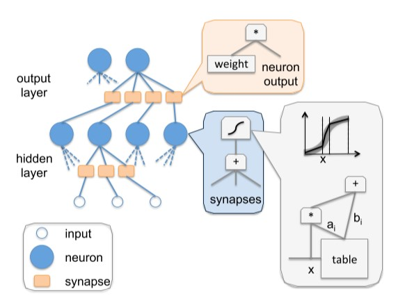

# 2.4 AI ハードウェア加速

モデルの学習や推論では CPU/GPU の性能がボトルネックになることがあります。そこで専用 AI チップの重要性が高まっています。本節に入る前に CPU/GPU の役割を簡単に整理します。

CPU（Central Processing Unit）は汎用の演算・制御装置で、命令の解釈・実行、入出力・メモリ資源の管理などを担います。

現代のコンピュータアーキテクチャでは、CPU はメモリや I/O など全ハード資源を制御・調停し、汎用計算を担う中核です。ソフトウェアの操作は命令セットを通じて最終的に CPU の動作へと写像されます。

GPU（Graphics Processing Unit）は多数の演算器を並べた並列計算に強いプロセッサです。CPU は命令解釈や分岐などの制御が重く、メモリ帯域も制約となりますが、GPU は行列演算のような同種の処理を大量に並列化でき、深層学習の学習・推論を高速化します。

注意：GPU は単独では動作せず、CPU に制御されます。また消費電力が高めです。AI の発展に伴い、より高効率な専用チップ（ASIC）が登場しました。

ASIC（Application-Specific Integrated Circuit）は特定用途向けに最適化されたチップで、性能/電力効率に優れます。設計コストや拡張性の課題はありますが、低消費電力・高信頼性が求められる用途で威力を発揮します。以降で述べる TPU、NPU は ASIC の一種です。

本節のゴール：

- TPU の概要
- NPU の概要

## 2.4.1 TPU

TPU（Tensor Processing Unit）は Google が設計したニューラルネットワーク向け ASIC です。TensorFlow の高速化を主目的に 2015 年に発表され、検索・画像・音声などの推論/学習に用いられます。

現在までに Google は第 4 世代までの TPU を公開しています。

### チップアーキテクチャ（概要）

TPU の構成（概要図）：

上图：In-datacenter performance analysis of a tensor processing unit，figure 1

最重要の演算器は行列積ユニット（MMU）で、256×256 の MAC（乗算加算）を備え、8bit 乗算と加算を高スループットで実行します。重み FIFO と Unified Buffer を入力に、計算結果は Accumulator に集約され、活性化ユニットで非線形関数を適用して Unified Buffer に戻します。

MMU は「シストリックアレイ（systolic array）」という構造で、データが波のように流れながら多数の ALU を通過します。レジスタの再利用と単純な ALU を大量に並べる設計により、高いエネルギー効率で行列演算を実現します。

一方で、データの並べ替えや規模適合性などの課題があります。CNN では配列入力の形やタイミングに制約があり、前処理の複雑さが増します。また、ベクトルが小さいと配列の利用率が下がり効率が落ちます。

### 技術的特徴

#### AI 加速専用

TPU は特定領域向け（Domain-specific）設計で、単純な制御と専用命令により深層学習の演算効率を最大化します。一方で汎用性は低く、用途は AI 加速に限定されます。

#### シストリックアレイ設計

シストリックアレイにより、行列演算を高密度に並列化し、データ再利用でメモリアクセスを削減します。帯域・電力効率の面で有利です。

MMU の配列は 256×256=65,536 の ALU で構成され、1 サイクル当たり 65,536 個の 8bit 乗算加算を実行できます。

動作周波数 700MHz では 65,536×700M ≒ 4.6×10^13 回/秒の乗算加算、すなわち約 92×10^12 の演算を行えます。

上图：In-datacenter performance analysis of a tensor processing unit，figure 4

#### 決定性と大容量オンチップメモリ

如图是TPU的平面设计简图，黄色为MMU运算单元，蓝色是统一缓存和累加器等数据单元，绿色是I/O，红色是逻辑控制单元。

上图：In-datacenter performance analysis of a tensor processing unit，figure 2

传统GPU由于片上内存较少，因此在运行过程中需要不断地去访问片外动态随机存取存储器（DRAM），从而在一定程度上浪费了不必要的能耗。与CPU和GPU相比，TPU的控制单元更小，更容易设计，面积只占了整个冲模的2%，给片上存储器和运算单元留下了更大的空间。如上图所示的TPU一代架构中，总共设计了占总芯片面积35%的内存，其中包括24MB的局部内存、4MB的累加器内存，以及用于与主控处理器对接的内存。这一比例大大超出了GPU等通用处理器，节约了大量片外数据访存能耗，使得TPU计算的能效比大大提高。从TPU二代开始采用HBM片上高带宽内存，虽然和最新一代GPU片上内存技术相同，但是TPU芯片的面积要远远小于GPU。硅片越小，成本越低，良品率也越高。

另外，由于TPU是一个单用途芯片，不需要考虑缓存、分支预测、多道处理等问题。这就意味着TPU的功能是单一且确定的。因此，我们可以使用TPU轻易的预测运行一个神经网络需要多长时间，这样我们就能让芯片以吞吐量接近峰值的状态运行，同时严格控制延迟。

## 2.4.2 NPU

NPU即Neural-network Processing Unit，中文名为神经网络处理器，它采用“数据驱动并行计算”的架构，特别擅长处理视频、图像类的海量多媒体数据。

长期以来，应用需求一直牵动着嵌入式技术的发展方向。随着深度学习神经网络的兴起，人工智能、大数据时代的来临，CPU和GPU渐渐难以满足深度学习的需要，面对日渐旺盛的需求和广大的预期市场，设计一款专门用于神经网络深度学习的高效智能处理器显得十分必要，因此NPU应运而生。

从技术角度看，深度学习实际上是一类多层大规模人工神经网络。它模仿生物神经网络而构建，由若干人工神经元结点互联而成。神经元之间通过突触两两连接，突触记录了神经元间联系的权值强弱。由于深度学习的基本操作是神经元和突触的处理，神经网络中存储和处理是一体化的，都是通过突触权重来体现，而冯·诺伊曼结构中，存储和处理是分离的，分别由存储器和运算器来实现，二者之间存在巨大的差异。当用现有的基于冯·诺伊曼结构的经典计算机(如X86处理器和英伟达GPU)运行神经网络应用时，就不可避免地受到存储和处理分离式结构的制约，因而影响效率。因此，专门针对人工智能的专业芯片NPU更有研发的必要和需求。

在NPU的设计上，中国走在了世界前列。下面我们将以寒武纪的DianNao系列架构为例，来简要介绍NPU。

### DianNao

上图：DianNao: a small-footprint high-throughput accelerator for ubiquitous machine-learning，figure 9

基于神经网络的人工智能算法，是模拟人类大脑内部神经元的结构。上图中的neuron代表的就是单个神经元，synapse代表神经元的突触。这个模型的工作模式，就要结合高中生物课的知识了。

一个神经元，有许多突触，给别的神经元传递信息。同样，这个神经元，也会接收来自许多其他神经元的信息。这个神经元所有接受到的信息累加，会有一个强烈程度，在生物上是以化学成分的形式存在，当这些信息达到一定的强烈程度，就会使整个神经元处于兴奋状态（激活），否则就是不兴奋（不激活）。如果兴奋了，就给其他神经元传递信息，如果不兴奋，就不传递。这就是单独一个神经元的工作模式。那么有成千上万个这样的神经元组合起来，就是一个神经网络模型。

那么DianNao是如何模拟神经元进行工作的呢，我们可以看看它的内部结构图：

上图：DianNao: a small-footprint high-throughput accelerator for ubiquitous machine-learning，figure 11

如图所示，上图中浅蓝色的部分就是用硬件逻辑模拟的神经网络架构，称为NFU（Neural Functional Units）。它可以被细分为三个部分，即途中的NFU-1，NFU-2，和NFU-3。

NFU-1是乘法单元，它采用16bit定点数乘法器，1位符号位，5位整数位，10位小数位。该部分总计有256个乘法器。这些乘法器的计算是同时的，也就是说，在一个周期内可以执行256次乘法。

NFU-2是加法树，总计16个，每一个加法树都是8-4-2-1这样的组成结构，即就是每一个加法树中都有15个加法器。

NFU-3是非线性激活函数，该部分由分段线性近似实现非线性函数，根据前面两个单元计算得到的刺激量，从而判断是否需要激活操作。

当需要实现向量相乘和卷积运算时，使用NFU-1完成对应位置元素相乘，NFU-2完成相乘结果相加，最后由NFU-3完成激活函数映射。完成池化运算时，使用NFU-2完成多个元素取最大值或取平均值运算。由此分析，尽管该运算模块非常简单，也覆盖了神经网络所需要的大部分运算。

### DaDianNao

作为DianNao的多核升级版本，DaDianNao的运算单元NFU与DianNao基本相同，最大的区别是为了完成训练任务多加了几条数据通路，且配置更加灵活。NFU的尺寸为16x16，即16个输出神经元，每个输出神经元有16个输入（输入端需要一次提供256个数据）。同时，NFU可以可选的跳过一些步骤以达到灵活可配置的功能。DaDianNao的NFU结构如下所示：

上图：DaDianNao: A Machine-Learning Supercomputer，figure 6

### ShiDianNao

ShiDianNao是机器视觉专用加速器，集成了视频处理的部分，它也是DianNao系列中唯一一个考虑运算单元级数据重用的加速器，也是唯一使用二维运算阵列的加速器，其加速器的运算阵列结构如下所示：

上图：ShiDianNao: Shifting vision processing closer to the sensor，figure 5

ShiDianNao的运算阵列为2D格点结构，对于每一个运算单元（节点）而言，运算所使用的参数统一来源于Kernel，而参与运算的数据则可能来自于：数据缓存NBin，下方的节点，右侧的节点。

下图为每个运算单元的结构：

上图：ShiDianNao: Shifting vision processing closer to the sensor，figure 6

该计算节点的功能包括转发数据和进行计算：

转发数据：每个数据可来源于右侧节点，下方节点和NBin，根据控制信号选择其中一个存储到输入寄存器中，且根据控制信号可选的将其存储到FIFO-H和FIFO-V中。同时根据控制信号选择FIFO-H和FIFO-V中的信号从FIFO output端口输出

进行计算：根据控制信号进行计算，包括相加，累加，乘加和比较等，并将结果存储到输出寄存器中，并根据控制信号选择寄存器或计算结果输出到PE output端口。

对于计算功能，根据上文的结构图，可以发现，PE支持的运算有：kernel和输入数据相乘并与输出寄存器数据相加（乘加），输入数据与输出寄存器数据取最大或最小（应用于池化），kernel与输入数据相加（向量加法），输入数据与输出寄存器数据相加（累加）等。

### PuDianNao

作为DianNao系列的收山之作，PuDianNao的运算单元是电脑系列中唯一一个异构的，除了有MLU（机器学习单元）外，还有一个ALU用于处理通用运算和MLU无法处理的运算，其运算单元（上）和MLU（下）结构如下图所示：

上图：PuDianNao: A Polyvalent Machine Learning Accelerator，figure 11&12

该MLU共分为6层：

计数层/比较层：这一层的处理为两个数按位与或比较大小，结果将被累加，这一层可以单独输出且可以被bypass

加法层：这一层为两个输入对应相加，这一层可以单独输出且可以被bypass

乘法层：这一层为两个输入或上一层（加法层）结果对应位置相乘，可以单独输出

加法树层：将乘法层的结果累加

累加层：将上一层（加法树层）的结果累加，可以单独输出

特殊处理层：由一个分段线性逼近实现的非线性函数和k排序器（输出上一层输出中最小的输出）组成

该运算单元是DianNao系列中功能最多的单元，配置非常灵活。例如实现向量相乘（对应位置相乘后累加）时，弃用计数层，加法层，将数据从乘法层，加法树层和累加层流过即可实现。

PuDianNao支持7种机器学习算法：神经网络，线性模型，支持向量机，决策树，朴素贝叶斯，K临近和K类聚，所需要支持的运算较多，因此PuDianNao的运算分析主要集中在存储方面，其运算核心的设计中说明PuDianNao支持的运算主要有：向量点乘，距离计算，计数，排序和非线性函数。其他未覆盖的计算使用ALU实现。

## 参考资料：

[In-datacenter performance analysis of a tensor processing unit](https://ieeexplore.ieee.org/abstract/document/8192463)

[Neural Network Processor](https://www.freepatentsonline.com/y2017/0103313.html)

[DianNao: a small-footprint high-throughput accelerator for ubiquitous machine-learning](https://dl.acm.org/doi/abs/10.1145/2654822.2541967)

[DaDianNao: A Machine-Learning Supercomputer](https://ieeexplore.ieee.org/document/7011421)

[ShiDianNao: Shifting vision processing closer to the sensor](https://ieeexplore.ieee.org/document/7284058)

[PuDianNao: A Polyvalent Machine Learning Accelerator](https://dl.acm.org/doi/abs/10.1145/2775054.2694358)
