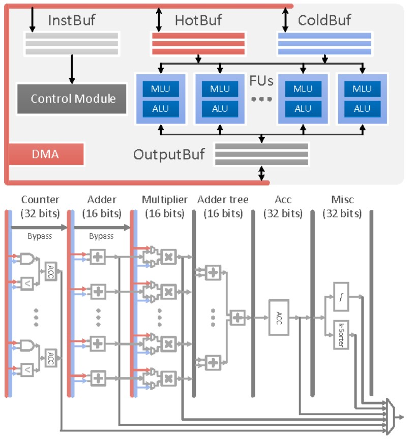

# 2.4 AI ハードウェア加速

モデルの学習や推論では CPU/GPU の性能がボトルネックになることがあります。そこで専用 AI チップの重要性が高まっています。本節に入る前に CPU/GPU の役割を簡単に整理します。

CPU（Central Processing Unit）は汎用の演算・制御装置で、命令の解釈・実行、入出力・メモリ資源の管理などを担います。

現代のコンピュータアーキテクチャでは、CPU はメモリや I/O など全ハード資源を制御・調停し、汎用計算を担う中核です。ソフトウェアの操作は命令セットを通じて最終的に CPU の動作へと写像されます。

GPU（Graphics Processing Unit）は多数の演算器を並べた並列計算に強いプロセッサです。CPU は命令解釈や分岐などの制御が重く、メモリ帯域も制約となりますが、GPU は行列演算のような同種の処理を大量に並列化でき、深層学習の学習・推論を高速化します。

注意：GPU は単独では動作せず、CPU に制御されます。また消費電力が高めです。AI の発展に伴い、より高効率な専用チップ（ASIC）が登場しました。

ASIC（Application-Specific Integrated Circuit）は特定用途向けに最適化されたチップで、性能/電力効率に優れます。設計コストや拡張性の課題はありますが、低消費電力・高信頼性が求められる用途で威力を発揮します。以降で述べる TPU、NPU は ASIC の一種です。

本節のゴール：

* TPU の概要
* NPU の概要

---

## 2.4.1 TPU

TPU（Tensor Processing Unit）は Google が設計したニューラルネットワーク向け ASIC です。TensorFlow の高速化を主目的に 2015 年に発表され、検索・画像・音声などの推論/学習に用いられます。

現在までに Google は第 4 世代までの TPU を公開しています。

### チップアーキテクチャ（概要）

TPU の構成（概要図）：

（図：In-datacenter performance analysis of a tensor processing unit，figure 1）

最重要の演算器は行列積ユニット（MMU）で、256×256 の MAC（乗算加算）を備え、8bit 乗算と加算を高スループットで実行します。重み FIFO と Unified Buffer を入力に、計算結果は Accumulator に集約され、活性化ユニットで非線形関数を適用して Unified Buffer に戻します。

MMU は「シストリックアレイ（systolic array）」という構造で、データが波のように流れながら多数の ALU を通過します。レジスタの再利用と単純な ALU を大量に並べる設計により、高いエネルギー効率で行列演算を実現します。

一方で、データの並べ替えや規模適合性などの課題があります。CNN では配列入力の形やタイミングに制約があり、前処理の複雑さが増します。また、ベクトルが小さいと配列の利用率が下がり効率が落ちます。

### 技術的特徴

#### AI 加速専用

TPU は特定領域向け（Domain-specific）設計で、単純な制御と専用命令により深層学習の演算効率を最大化します。一方で汎用性は低く、用途は AI 加速に限定されます。

#### シストリックアレイ設計

シストリックアレイにより、行列演算を高密度に並列化し、データ再利用でメモリアクセスを削減します。帯域・電力効率の面で有利です。

MMU の配列は 256×256=65,536 の ALU で構成され、1 サイクル当たり 65,536 個の 8bit 乗算加算を実行できます。

動作周波数 700MHz では 65,536×700M ≒ 4.6×10^13 回/秒の乗算加算、すなわち約 92×10^12 の演算を行えます。

（図：In-datacenter performance analysis of a tensor processing unit，figure 4）

#### 決定性と大容量オンチップメモリ

下図は TPU の平面設計概略図。黄色が MMU 演算ユニット、青が統一バッファや累加器などのデータユニット、緑が I/O、赤が論理制御ユニットです。

（図：In-datacenter performance analysis of a tensor processing unit，figure 2）

従来の GPU はオンチップメモリが少ないため、処理中に DRAM へ頻繁にアクセスし、不要な消費電力を生みます。TPU は制御部が小さく（面積の約2%）、残りを演算ユニットとオンチップメモリに割きます。第1世代では 24MB のローカルメモリ、4MB の累加器メモリなど合計 35% をメモリが占めます。これによりオフチップアクセスを大幅に削減し、エネルギー効率を改善しました。第2世代からは HBM を採用し、最新 GPU と同等の帯域を確保しつつ小型化を維持しています。

また、TPU は単用途設計でキャッシュや分岐予測などを持たず、挙動が決定的です。これにより性能予測が容易で、スループットをピークに近づけつつ遅延を抑制できます。

---

## 2.4.2 NPU

NPU（Neural-network Processing Unit、神経ネットワーク処理器）は「データ駆動並列計算」の構造を採用し、特に映像・画像のような大規模マルチメディアデータの処理に強みを持ちます。

深層学習の台頭とともに、CPU や GPU は効率的に対応できなくなり、専用チップとして NPU が登場しました。

深層学習は人工神経回路網を模倣しており、ニューロン間の結合（シナプス）により処理と記憶が一体化されています。従来型（フォン・ノイマン型）コンピュータでは演算器と記憶装置が分離しており、この構造的差異が効率低下を招きます。そのため NPU のような専用アーキテクチャの必要性が高まりました。

特に中国は NPU 設計において先行しており、代表例が寒武紀（Cambricon）の DianNao 系列です。

---

### DianNao

（図：DianNao: a small-footprint high-throughput accelerator for ubiquitous machine-learning，figure 9）

DianNao の中核は NFU（Neural Functional Unit）で、以下の3段階構成です：

* **NFU-1：乗算器群**
  16bit 定点数（1符号+5整数+10小数）を扱う256個の乗算器を搭載。1サイクルで256回の乗算を実行。

* **NFU-2：加算木**
  16本の加算ツリーを持ち、各ツリーは8-4-2-1 構造で15個の加算器を含む。

* **NFU-3：非線形関数**
  区分的線形近似により ReLU などの活性化を実現。

これにより、行列積・畳み込み・プーリングなど神経ネットワークの主要演算をカバーします。

---

### DaDianNao

DianNao の多コア拡張版。NFU は基本構造を維持しつつ、訓練用に複数のデータパスを追加。16×16 構造で、16ニューロン×16入力＝256入力データを一度に処理可能。柔軟にステップをスキップ可能な設計を採用。

（図：DaDianNao: A Machine-Learning Supercomputer，figure 6）

---

### ShiDianNao

ShiDianNao は機械視覚専用。唯一 2D アレイ構造を採用し、ノード間でデータを転送しながら演算を行います。CNN の局所的データ再利用に最適化。

（図：ShiDianNao: Shifting vision processing closer to the sensor，figure 5）

ノードは以下を持つ：

* 入力選択（右/下/キャッシュから選択）
* FIFO-H/V による転送
* 演算（加算・累積・乗算加算・比較など）

（図：ShiDianNao: Shifting vision processing closer to the sensor，figure 6）

---

### PuDianNao

シリーズ最終作。異種混合構成を採用し、MLU（Machine Learning Unit）と ALU を統合。
MLU は6層で構成：

1. 計数/比較層
2. 加算層
3. 乗算層
4. 加算木層
5. 累積層
6. 特殊処理層（非線形・k選択）

（図：PuDianNao: A Polyvalent Machine Learning Accelerator，figure 11&12）

これにより、ニューラルネットワークに加え、SVM・決定木・k-means など7種の機械学習アルゴリズムに対応。

---

## 参考資料

* [In-datacenter performance analysis of a tensor processing unit](https://ieeexplore.ieee.org/abstract/document/8192463)
* [Neural Network Processor](https://www.freepatentsonline.com/y2017/0103313.html)
* [DianNao: a small-footprint high-throughput accelerator for ubiquitous machine-learning](https://dl.acm.org/doi/abs/10.1145/2654822.2541967)
* [DaDianNao: A Machine-Learning Supercomputer](https://ieeexplore.ieee.org/document/7011421)
* [ShiDianNao: Shifting vision processing closer to the sensor](https://ieeexplore.ieee.org/document/7284058)
* [PuDianNao: A Polyvalent Machine Learning Accelerator](https://dl.acm.org/doi/abs/10.1145/2775054.2694358)

---

