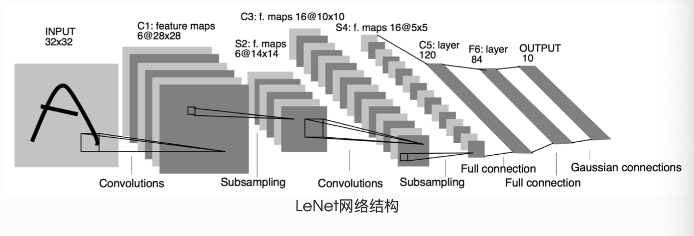

# 3.4 モデル構築
深層学習の発展とともに多様なモデルが提案されてきました。PyTorch では `nn.Module` を継承して柔軟にニューラルネットを構築します。

本節のゴール：

- PyTorch におけるネットワーク構築方法
- カスタム層の作り方
- LeNet の簡単な実装

## 3.4.1 ニューラルネットの構築

`torch.nn.Module` は全てのネットワークモジュールの基底クラスです。これを継承して `__init__` で層を定義し、`forward` で前向き計算を記述します。以下は 2 つの隠れ層を持つ MLP の例です。

```python
import torch
from torch import nn

class MLP(nn.Module):
  # 声明带有模型参数的层，这里声明了两个全连接层
  def __init__(self, **kwargs):
    # 调用MLP父类Block的构造函数来进行必要的初始化。这样在构造实例时还可以指定其他函数
    super(MLP, self).__init__(**kwargs)
    self.hidden = nn.Linear(784, 256)
    self.act = nn.ReLU()
    self.output = nn.Linear(256,10)
    
   # 定义模型的前向计算，即如何根据输入x计算返回所需要的模型输出
  def forward(self, x):
    o = self.act(self.hidden(x))
    return self.output(o)   
```

MLP では逆伝播を自前で定義する必要はありません。自動微分により `backward` が自動で生成されます。

インスタンス化して入力 `X` を与えると、`__call__` が `forward` を呼び出して前向き計算を実行します。自作モデルでは `forward` の定義が必須です。

```python
X = torch.rand(2,784) # 设置一个随机的输入张量
net = MLP() # 实例化模型
print(net) # 打印模型
net(X) # 前向计算
```
```python
MLP(
  (hidden): Linear(in_features=784, out_features=256, bias=True)
  (act): ReLU()
  (output): Linear(in_features=256, out_features=10, bias=True)
)
tensor([[ 0.0149, -0.2641, -0.0040,  0.0945, -0.1277, -0.0092,  0.0343,  0.0627,
         -0.1742,  0.1866],
        [ 0.0738, -0.1409,  0.0790,  0.0597, -0.1572,  0.0479, -0.0519,  0.0211,
         -0.1435,  0.1958]], grad_fn=<AddmmBackward>)
```

なお `Module` は「層」にも「モデル」にもなり得る汎用コンポーネントです（`nn.Linear` も `Module` の一種）。

## 3.4.2 よく使う層とカスタム層

全結合・畳み込み・プーリング・RNN など多様な層があります。標準層に加えて、`Module` を継承してカスタム層も作成できます。

- **パラメータを持たない層**

まずはパラメータを持たない層の例です。入力から平均を引いて返すだけの層を `forward` に記述します。

```python
import torch
from torch import nn

class MyLayer(nn.Module):
    def __init__(self, **kwargs):
        super(MyLayer, self).__init__(**kwargs)
    def forward(self, x):
        return x - x.mean()  
```

前向計算のテスト：

```python
layer = MyLayer()
layer(torch.tensor([1, 2, 3, 4, 5], dtype=torch.float))
```
```python
tensor([-2., -1.,  0.,  1.,  2.])
```

- **パラメータを持つ層**

学習可能なパラメータを持つ層も定義できます。`nn.Parameter` は `Tensor` のサブクラスで、`Module` に登録され自動的に最適化対象になります。複数管理には `ParameterList` や `ParameterDict` が便利です。

```python
class MyListDense(nn.Module):
    def __init__(self):
        super(MyListDense, self).__init__()
        self.params = nn.ParameterList([nn.Parameter(torch.randn(4, 4)) for i in range(3)])
        self.params.append(nn.Parameter(torch.randn(4, 1)))

    def forward(self, x):
        for i in range(len(self.params)):
            x = torch.mm(x, self.params[i])
        return x
net = MyListDense()
print(net)
```

```python
class MyDictDense(nn.Module):
    def __init__(self):
        super(MyDictDense, self).__init__()
        self.params = nn.ParameterDict({
                'linear1': nn.Parameter(torch.randn(4, 4)),
                'linear2': nn.Parameter(torch.randn(4, 1))
        })
        self.params.update({'linear3': nn.Parameter(torch.randn(4, 2))}) # 新增

    def forward(self, x, choice='linear1'):
        return torch.mm(x, self.params[choice])

net = MyDictDense()
print(net)
```

以下、畳み込みやプーリングなどの例を示します。

- **二维卷积层**

2D 畳み込みはカーネルとの相互相関とバイアス加算で出力を得ます。学習ではカーネルとバイアスを更新します。

```python
import torch
from torch import nn

# 卷积运算（二维互相关）
def corr2d(X, K): 
    h, w = K.shape
    X, K = X.float(), K.float()
    Y = torch.zeros((X.shape[0] - h + 1, X.shape[1] - w + 1))
    for i in range(Y.shape[0]):
        for j in range(Y.shape[1]):
            Y[i, j] = (X[i: i + h, j: j + w] * K).sum()
    return Y

# 二维卷积层
class Conv2D(nn.Module):
    def __init__(self, kernel_size):
        super(Conv2D, self).__init__()
        self.weight = nn.Parameter(torch.randn(kernel_size))
        self.bias = nn.Parameter(torch.randn(1))

    def forward(self, x):
        return corr2d(x, self.weight) + self.bias
```

卷积窗口形状为 $p \times q$ 的卷积层称为 $p \times q$  卷积层。同样，  $p \times q$ 卷积或 $p \times q$ 卷积核说明卷积核的高和宽分别为 $p$ 和 $q$，一般情况下，$p=q$。

パディングは入力の縁に要素（通常は 0）を付加して空間サイズを調整する操作です。

下面的例子里我们创建一个⾼和宽为3的二维卷积层，然后设输⼊高和宽两侧的填充数分别为1。给定一个高和宽为8的输入，我们发现输出的高和宽也是8。

```python
import torch
from torch import nn

# 定义一个函数来计算卷积层。它对输入和输出做相应的升维和降维
def comp_conv2d(conv2d, X):
    # (1, 1)代表批量大小和通道数
    X = X.view((1, 1) + X.shape)
    Y = conv2d(X)
    return Y.view(Y.shape[2:]) # 排除不关心的前两维:批量和通道


# 注意这里是两侧分别填充1⾏或列，所以在两侧一共填充2⾏或列
conv2d = nn.Conv2d(in_channels=1, out_channels=1, kernel_size=3,padding=1)

X = torch.rand(8, 8)
comp_conv2d(conv2d, X).shape
```
```python
torch.Size([8, 8])
```

当卷积核的高和宽不同时，我们也可以通过设置高和宽上不同的填充数使输出和输入具有相同的高和宽。

```python
# 使用高为5、宽为3的卷积核。在⾼和宽两侧的填充数分别为2和1
conv2d = nn.Conv2d(in_channels=1, out_channels=1, kernel_size=(5, 3), padding=(2, 1))
comp_conv2d(conv2d, X).shape
```
```python
torch.Size([8, 8])
```
カーネルを滑らせるピッチはストライドで指定します。

```python
conv2d = nn.Conv2d(1, 1, kernel_size=(3, 5), padding=(0, 1), stride=(3, 4))
comp_conv2d(conv2d, X).shape
```
```python
torch.Size([2, 2])
```

填充可以增加输出的高和宽。这常用来使输出与输入具有相同的高和宽。

步幅可以减小输出的高和宽，例如输出的高和宽仅为输入的高和宽的 ( 为大于1的整数)。

- **池化层**

池化层每次对输入数据的一个固定形状窗口(⼜称池化窗口)中的元素计算输出。不同于卷积层里计算输⼊和核的互相关性，池化层直接计算池化窗口内元素的属性（均值、最大值等）。常见的池化包括最大池化或平均池化。在二维最⼤池化中，池化窗口从输入数组的最左上方开始，按从左往右、从上往下的顺序，依次在输⼊数组上滑动。当池化窗口滑动到某⼀位置时，窗口中的输入子数组的最大值即输出数组中相应位置的元素。

下面把池化层的前向计算实现在`pool2d`函数里。

```python
import torch
from torch import nn

def pool2d(X, pool_size, mode='max'):
    p_h, p_w = pool_size
    Y = torch.zeros((X.shape[0] - p_h + 1, X.shape[1] - p_w + 1))
    for i in range(Y.shape[0]):
        for j in range(Y.shape[1]):
            if mode == 'max':
                Y[i, j] = X[i: i + p_h, j: j + p_w].max()
            elif mode == 'avg':
                Y[i, j] = X[i: i + p_h, j: j + p_w].mean()
    return Y
```

```python
X = torch.tensor([[0, 1, 2], [3, 4, 5], [6, 7, 8]], dtype=torch.float)
pool2d(X, (2, 2))
```
```python
tensor([[4., 5.],
	[7., 8.]])
```
```python
pool2d(X, (2, 2), 'avg')
```
```python
tensor([[2., 3.],
	[5., 6.]])
```

我们可以使用`torch.nn`包来构建神经网络。我们已经介绍了`autograd`包，`nn`包则依赖于`autograd`包来定义模型并对它们求导。一个`nn.Module`包含各个层和一个`forward(input)`方法，该方法返回`output`。

## 3.4.3 模型示例

- **LeNet**



这是一个简单的前馈神经网络 (feed-forward network）（LeNet）。它接受一个输入，然后将它送入下一层，一层接一层的传递，最后给出输出。

一个神经网络的典型训练过程如下：

1. 定义包含一些可学习参数(或者叫权重）的神经网络
2. 在输入数据集上迭代
3. 通过网络处理输入
4. 计算 loss (输出和正确答案的距离）
5. 将梯度反向传播给网络的参数
6. 更新网络的权重，一般使用一个简单的规则：`weight = weight - learning_rate * gradient`

```python
import torch
import torch.nn as nn
import torch.nn.functional as F


class Net(nn.Module):

    def __init__(self):
        super(Net, self).__init__()
        # 输入图像channel：1；输出channel：6；5x5卷积核
        self.conv1 = nn.Conv2d(1, 6, 5)
        self.conv2 = nn.Conv2d(6, 16, 5)
        # an affine operation: y = Wx + b
        self.fc1 = nn.Linear(16 * 5 * 5, 120)
        self.fc2 = nn.Linear(120, 84)
        self.fc3 = nn.Linear(84, 10)

    def forward(self, x):
        # 2x2 Max pooling
        x = F.max_pool2d(F.relu(self.conv1(x)), (2, 2))
        # 如果是方阵,则可以只使用一个数字进行定义
        x = F.max_pool2d(F.relu(self.conv2(x)), 2)
        x = x.view(-1, self.num_flat_features(x))
        x = F.relu(self.fc1(x))
        x = F.relu(self.fc2(x))
        x = self.fc3(x)
        return x

    def num_flat_features(self, x):
        size = x.size()[1:]  # 除去批处理维度的其他所有维度
        num_features = 1
        for s in size:
            num_features *= s
        return num_features


net = Net()
print(net)
```
```python
Net(
  (conv1): Conv2d(1, 6, kernel_size=(5, 5), stride=(1, 1))
  (conv2): Conv2d(6, 16, kernel_size=(5, 5), stride=(1, 1))
  (fc1): Linear(in_features=400, out_features=120, bias=True)
  (fc2): Linear(in_features=120, out_features=84, bias=True)
  (fc3): Linear(in_features=84, out_features=10, bias=True)
)
```


我们只需要定义 `forward` 函数，`backward`函数会在使用`autograd`时自动定义，`backward`函数用来计算导数。我们可以在 `forward` 函数中使用任何针对张量的操作和计算。

一个模型的可学习参数可以通过`net.parameters()`返回

```python
params = list(net.parameters())
print(len(params))
print(params[0].size())  # conv1的权重
```
```python
10
torch.Size([6, 1, 5, 5])
```
让我们尝试一个随机的 32x32 的输入。注意:这个网络 (LeNet）的期待输入是 32x32 的张量。如果使用 MNIST 数据集来训练这个网络，要把图片大小重新调整到 32x32。

```python
input = torch.randn(1, 1, 32, 32)
out = net(input)
print(out)
```

清零所有参数的梯度缓存，然后进行随机梯度的反向传播：

```python
net.zero_grad()
out.backward(torch.randn(1, 10))
```

注意：`torch.nn`只支持小批量处理 (mini-batches）。整个 `torch.nn` 包只支持小批量样本的输入，不支持单个样本的输入。比如，`nn.Conv2d` 接受一个4维的张量，即`nSamples x nChannels x Height x Width `如果是一个单独的样本，只需要使用`input.unsqueeze(0)` 来添加一个“假的”批大小维度。

- `torch.Tensor` - 一个多维数组，支持诸如`backward()`等的自动求导操作，同时也保存了张量的梯度。

- `nn.Module `- 神经网络模块。是一种方便封装参数的方式，具有将参数移动到GPU、导出、加载等功能。

- `nn.Parameter `- 张量的一种，当它作为一个属性分配给一个`Module`时，它会被自动注册为一个参数。

- `autograd.Function` - 实现了自动求导前向和反向传播的定义，每个`Tensor`至少创建一个`Function`节点，该节点连接到创建`Tensor`的函数并对其历史进行编码。

下面再介绍一个比较基础的案例AlexNet

- **AlexNet**


```python
class AlexNet(nn.Module):
    def __init__(self):
        super(AlexNet, self).__init__()
        self.conv = nn.Sequential(
            nn.Conv2d(1, 96, 11, 4), # in_channels, out_channels, kernel_size, stride, padding
            nn.ReLU(),
            nn.MaxPool2d(3, 2), # kernel_size, stride
            # 减小卷积窗口，使用填充为2来使得输入与输出的高和宽一致，且增大输出通道数
            nn.Conv2d(96, 256, 5, 1, 2),
            nn.ReLU(),
            nn.MaxPool2d(3, 2),
            # 连续3个卷积层，且使用更小的卷积窗口。除了最后的卷积层外，进一步增大了输出通道数。
            # 前两个卷积层后不使用池化层来减小输入的高和宽
            nn.Conv2d(256, 384, 3, 1, 1),
            nn.ReLU(),
            nn.Conv2d(384, 384, 3, 1, 1),
            nn.ReLU(),
            nn.Conv2d(384, 256, 3, 1, 1),
            nn.ReLU(),
            nn.MaxPool2d(3, 2)
        )
         # 这里全连接层的输出个数比LeNet中的大数倍。使用丢弃层来缓解过拟合
        self.fc = nn.Sequential(
            nn.Linear(256*5*5, 4096),
            nn.ReLU(),
            nn.Dropout(0.5),
            nn.Linear(4096, 4096),
            nn.ReLU(),
            nn.Dropout(0.5),
            # 输出层。由于这里使用Fashion-MNIST，所以用类别数为10，而非论文中的1000
            nn.Linear(4096, 10),
        )

    def forward(self, img):
        feature = self.conv(img)
        output = self.fc(feature.view(img.shape[0], -1))
        return output
```

```python
net = AlexNet()
print(net)
```
```python
AlexNet(
  (conv): Sequential(
    (0): Conv2d(1, 96, kernel_size=(11, 11), stride=(4, 4))
    (1): ReLU()
    (2): MaxPool2d(kernel_size=3, stride=2, padding=0, dilation=1, ceil_mode=False)
    (3): Conv2d(96, 256, kernel_size=(5, 5), stride=(1, 1), padding=(2, 2))
    (4): ReLU()
    (5): MaxPool2d(kernel_size=3, stride=2, padding=0, dilation=1, ceil_mode=False)
    (6): Conv2d(256, 384, kernel_size=(3, 3), stride=(1, 1), padding=(1, 1))
    (7): ReLU()
    (8): Conv2d(384, 384, kernel_size=(3, 3), stride=(1, 1), padding=(1, 1))
    (9): ReLU()
    (10): Conv2d(384, 256, kernel_size=(3, 3), stride=(1, 1), padding=(1, 1))
    (11): ReLU()
    (12): MaxPool2d(kernel_size=3, stride=2, padding=0, dilation=1, ceil_mode=False)
  )
  (fc): Sequential(
    (0): Linear(in_features=6400, out_features=4096, bias=True)
    (1): ReLU()
    (2): Dropout(p=0.5)
    (3): Linear(in_features=4096, out_features=4096, bias=True)
    (4): ReLU()
    (5): Dropout(p=0.5)
    (6): Linear(in_features=4096, out_features=10, bias=True)
  )
)
```
